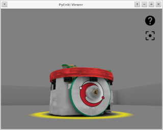
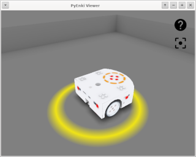
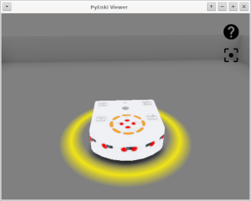

# pyPlayground

Playground in Python3x using [ENKI Robot Simulator](https://github.com/enki-community/enki)

  

  

Tested on
+ Linux
	+ Debian 11, Python 3.9.2, Qt5.15.2, libbost-python 1.74.0
+ Windows
	+ Windows 10, Python 3.9.0, Qt5.12.10, Boost 1.76.0

v1.0.0
+ Move world.README to top directory for easy reference
+ Fix transparency in *.worlds files
+ Add support for setLed in both robots
+ Add test for leds
+ Fit .gitignore 
+ Push pyenki.so
+ Add Test for LEds
+ First functional Release

v0.2.1
+ Missing pyenki.pyd on commit (just for windows)

v0.2.0
+ Added support for Windows
	+ Remove non-blocking socket operation
	+ Fix code for QT and DLLs paths
	+ Add pyplayground/server/windows/dll for DDLs
	+ Add pyplayground/server/windows/qt for DDLs
	+ Build with Qt5.12.10
	+ Build with Boost 1.76.0
	+ Tested on Windows 10 real machine
	+ Tested on Windows 10 KVM/QUEMU VM

v0.1.0
+ Support for Linux only
+ Epuck robot with proximity sensors only
+ Thymio2 robot with proximity and ground sensor only
