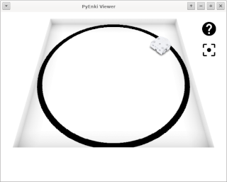
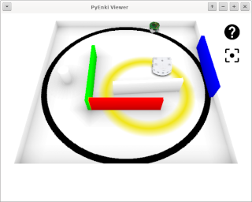
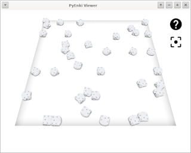

# pyPlayground

Playground in Python3x using [ENKI Robot Simulator](https://github.com/enki-community/enki)

v0.2.0
+ Added support for Windows
	+ Remove non-blocking socket operation
	+ Fix code for QT and DLLs paths
	+ Add pyplayground/server/windows/dll for DDLs
	+ Add pyplayground/server/windows/qt for DDLs
	+ Build with Qt5.12.10
	+ Build with Boost 1.76.0
	+ Tested on Windows 10 real machine
	+ Tested on Windows 10 KVM/QUEMU VM

v0.1.0
+ Support for Linux only
+ Epuck robot with proximity sensors only
+ Thymio2 robot with proximity and ground sensor only
