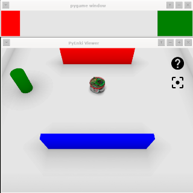

# pyPlayground

Playground in Python3x using [ENKI Robot Simulator](https://github.com/enki-community/enki)

  

  

 

Tested on
+ Linux
	+ Debian 11, Python 3.9.2, Qt5.15.2, libbost-python 1.74.0
+ Windows
	+ Windows 10, Python 3.9.0, Qt5.12.10, Boost 1.76.0
